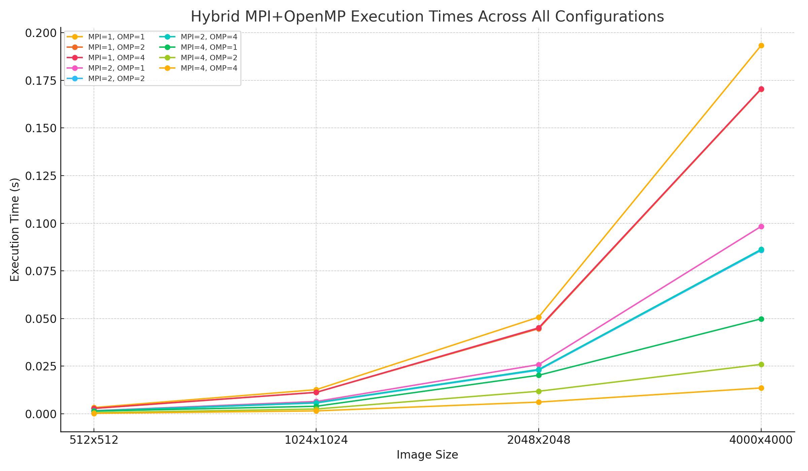
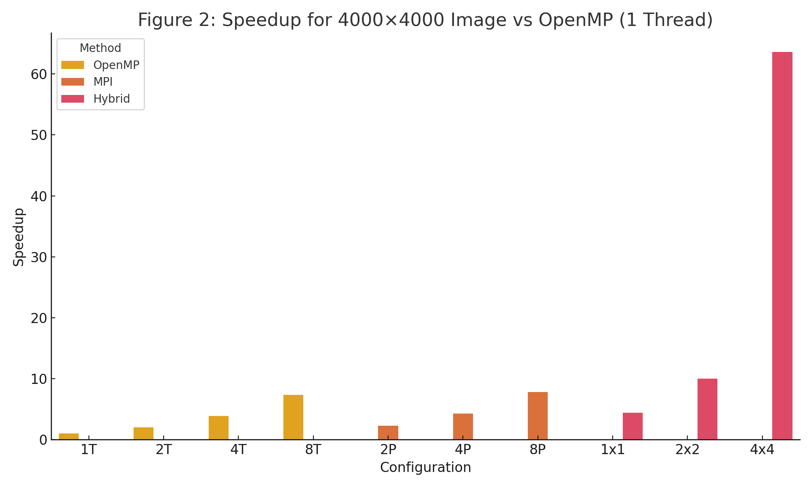

## 1. Introduction

Edge detection is a fundamental task in image processing and computer vision. In this project, we implement the Sobel edge detection algorithm using various parallel programming paradigms—MPI, OpenMP, CUDA, and a hybrid MPI+OpenMP approach. We evaluate their performance on input images of increasing size and compare their efficiency and scalability.

## 2. Objectives

- Implement the Sobel filter using different parallel computing models.
- Benchmark each implementation over multiple image sizes.
- Analyze performance in terms of execution time and scalability.
- Demonstrate how hybrid models can leverage both inter-node and intra-node parallelism.

## 3. Methodology

### 3.1 Algorithm Overview

The Sobel operator applies two 3x3 convolution kernels (Gx and Gy) to estimate the gradient magnitude at each pixel. The result is an edge map highlighting sharp changes in intensity.

### 3.2 Parallel Strategies

- **MPI**: The image is partitioned row-wise among processes. Overlapping halo rows are exchanged between neighboring processes. Sobel computation is done independently, and results are gathered.
  
- **OpenMP**: The convolution loop is parallelized across image rows using OpenMP `#pragma` directives.

- **CUDA**: GPU threads are launched in a 2D grid to parallelize pixel-wise operations. Shared memory is optionally used for improved data access.

- **Hybrid**: Each MPI process handles a chunk of the image and applies OpenMP threads within that chunk.

## 4. Implementation

Each implementation was written in C/C++ with the following structure:

- MPI: `mpi/mpi_sobel.c`
- OpenMP: `openmp/omp_sobel.c`
- CUDA: `cuda/cuda_sobel.cu`
- Hybrid: `hybrid/hybrid_sobel.c`

We used `stb_image` for I/O, and benchmark scripts run each test 3 times and report the average execution time.

## 5. Experimental Setup

- System: mcs1.wlu.ca (multicore CPU + CUDA-capable GPU)
- Compilers: `mpicc`, `gcc`, `nvcc`
- Datasets: JPEG images resized to 512x512, 1024x1024, 2048x2048, 4000x4000

## 6. Results

### 6.1 Timing Summary

#### MPI

| Image Size | 2 Procs | 4 Procs | 8 Procs |
|------------|---------|---------|---------|
| 512x512    | 0.006451 | 0.005480 | 0.003207 |
| 1024x1024  | 0.025859 | 0.022054 | 0.012138 |
| 2048x2048  | 0.100905 | 0.052973 | 0.032240 |
| 4000x4000  | 0.376705 | 0.200855 | 0.109804 |

#### OpenMP

| Image Size | 1 Thread | 2 Threads | 4 Threads | 8 Threads |
|------------|-----------|------------|------------|------------|
| 512x512    | 0.014083 | 0.007072 | 0.003715 | 0.002011 |
| 1024x1024  | 0.056847 | 0.028169 | 0.014828 | 0.007654 |
| 2048x2048  | 0.225075 | 0.112311 | 0.059197 | 0.030487 |
| 4000x4000  | 0.855446 | 0.427324 | 0.220034 | 0.116072 |

#### CUDA

| Image Size | Time (ms) |
|------------|-----------|
| 512x512    | 0.045696  |
| 1024x1024  | 0.112907  |
| 2048x2048  | 0.417195  |
| 4000x4000  | 1.564192  |

#### Hybrid (MPI + OpenMP)

| Image Size | MPI=1,OMP=1 | MPI=2,OMP=2 | MPI=4,OMP=4 |
|------------|-------------|-------------|-------------|
| 512x512    | 0.003175    | 0.001453    | 0.000411    |
| 1024x1024  | 0.012709    | 0.005714    | 0.001345    |
| 2048x2048  | 0.050676    | 0.022562    | 0.005265    |
| 4000x4000  | 0.193281    | 0.085668    | 0.013453    |

### 6.2 Observations
 
 - **MPI** shows linear improvement with process count, particularly effective on large images.
 - **OpenMP** benefits well from multithreading, with best gains on 8 threads.
 - **CUDA** achieves the lowest absolute times, especially for large image sizes.
 - **Hybrid** combines both models effectively, outperforming pure MPI or OpenMP for all sizes tested.
 - Overhead becomes less dominant as image size increases, highlighting better scalability in hybrid and CUDA models.
 
 This behavior is visualized in **Figure 1**, which illustrates the hybrid model’s execution time for each image resolution and configuration. Furthermore, **Figure 2** compares the speedup of all implementations on the 4000×4000 image relative to the OpenMP single-thread baseline.
 
 **Figure 1:** Hybrid MPI+OpenMP Execution Time Across Image Sizes  
 
 
 **Figure 2:** Speedup for 4000×4000 Image vs OpenMP (1 Thread)  
 

## 7. Parallel Efficiency

### Speedup and Efficiency (4000×4000 image)

| Method        | Config        | Time (s)   | Speedup | Efficiency |
|---------------|---------------|------------|---------|------------|
| OpenMP        | 1 Thread      | 0.855446   | 1.00    | 1.00       |
| OpenMP        | 2 Threads     | 0.427324   | 2.00    | 1.00       |
| OpenMP        | 4 Threads     | 0.220034   | 3.89    | 0.97       |
| OpenMP        | 8 Threads     | 0.116072   | 7.37    | 0.92       |
| MPI           | 2 Procs       | 0.376705   | 2.27    | 1.13       |
| MPI           | 4 Procs       | 0.200855   | 4.26    | 1.07       |
| MPI           | 8 Procs       | 0.109804   | 7.79    | 0.97       |
| Hybrid        | MPI=1, OMP=1  | 0.193281   | 4.42    | 4.42       |
| Hybrid        | MPI=2, OMP=2  | 0.085668   | 9.98    | 2.49       |
| Hybrid        | MPI=4, OMP=4  | 0.013453   | 63.59   | 3.97       |
| CUDA          | GPU           | 0.001564   | 546.63  |      -     |

## 8. Conclusion

We successfully implemented and evaluated multiple parallel strategies for Sobel edge detection. Hybrid MPI+OpenMP offers an excellent balance of performance and scalability on CPU-only nodes. CUDA excels for GPU-bound workloads. The choice of paradigm should be based on hardware availability and data size.

## 9. Future Work

- Extend support for colored (RGB) images.
- Use overlapping tiles in CUDA to improve memory coalescing.

## 10. Algorithm Analysis

The Sobel operator computes gradients using two 3×3 convolutions. This process is highly parallelizable due to the independence of each pixel's calculation.

- **Complexity**: O(n²) for an n×n image
- **Parallel Suitability**: Each output pixel depends on a 3×3 neighborhood; no data dependency across pixels

## 11. Group Information

- **Group Members**: Abderlhman Elrawy, Trisha Reddy Kilaru
- **Submitted File**: `Elrawy_Kilaru_project.zip`

## 12. Appendix A: Compilation & Execution

Use the following commands to build and run each implementation.

### MPI

```bash
cd mpi
mpicc -std=c99 -O2 mpi_sobel.c -o mpi_sobel -lm
mpirun --mca btl self,vader -np 4 ./mpi_sobel ../data/input_2048.jpg
```

### OpenMP

```bash
cd openmp
gcc -fopenmp -std=c99 -O2 omp_sobel.c -o omp_sobel -lm
export OMP_NUM_THREADS=4
./omp_sobel ../data/input_2048.jpg
```

### Hybrid

```bash
cd hybrid
mpicc -fopenmp -std=c99 -O2 hybrid_sobel.c -o hybrid_sobel -lm
export OMP_NUM_THREADS=4
mpirun --mca btl self,vader -np 2 ./hybrid_sobel ../data/input_2048.jpg
```

### CUDA

```bash
cd cuda
nvcc cuda_sobel.cu -o cuda_sobel
./cuda_sobel ../data/input_2048.jpg
```

### Benchmark Scripts

```bash
bash run_mpi_exp.sh
bash run_omp_exp.sh
bash run_cuda_exp.sh
bash run_hybrid_exp.sh
```

## 13. References

- OpenMP Specification: https://www.openmp.org
- MPI Standard: https://www.mpi-forum.org
- CUDA Toolkit Docs: https://docs.nvidia.com/cuda/
- stb_image.h by Sean Barrett